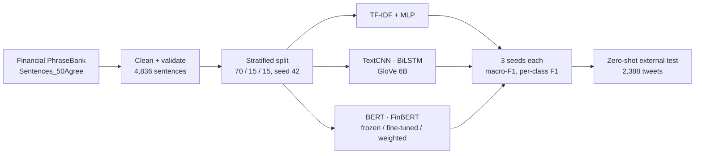

# Financial Sentiment Classification with Domain-Adapted Transformers

> Team project for UNSW COMP9444 Neural Networks and Deep Learning (Term 2, 2026), shown here for portfolio purposes. Source code is kept private under university academic-integrity rules; **source available on request**.

Three-class sentiment classification of financial sentences (Financial PhraseBank), benchmarking five model families under one fixed protocol to answer a practical question: how much does financial-domain pre-training actually buy once you fine-tune?

## Results

- **12 configurations × 3 seeds = 36 training runs**, all on the same stratified 70/15/15 split of 4,836 cleaned sentences, reported as mean ± SD. Class-weighted FinBERT reached **macro-F1 0.861 ± 0.007**, 21% above the TF-IDF + MLP baseline (0.714).
- **2 × 3 controlled comparison** (BERT vs FinBERT × frozen / fine-tuned / fine-tuned + class weights): the financial pre-training advantage shrinks from **+0.277 macro-F1 when frozen to about +0.01 once fine-tuned**. Class weighting gave no consistent benefit and hurt BERT on every class.
- **Leakage found and excluded**: the popular public `ProsusAI/finbert` checkpoint scores 88.9% zero-shot on this dataset because it was fine-tuned on it; we dropped it from the comparison and cite it only as a literature number.
- **Domain-shift check**: strict zero-shot evaluation on 2,388 financial tweets drops macro-F1 from 0.861 to **0.676**, quantifying deployment risk.

## My role

Team lead in a team of five: shared data pipeline (cleaning, fixed splits, class weights, annotator-agreement flag), the pretrained-transformer track (BERT and FinBERT, frozen / fine-tuned / weighted), the checkpoint-leakage investigation, the external-dataset evaluation, and the results analysis.

## Pipeline

## Tech stack

PyTorch · Hugging Face Transformers (bert-base-uncased, yiyanghkust/finbert-pretrain) · scikit-learn · pandas · Jupyter (Colab GPU)

## Data

- Financial PhraseBank (Malo et al., 2014), CC BY-NC-SA 3.0 — download from the original release or the Hugging Face dataset `takala/financial_phrasebank`.
- GloVe 6B embeddings (Stanford NLP, Public Domain Dedication).
- External test: `zeroshot/twitter-financial-news-sentiment` validation split (Hugging Face), used for evaluation only.

## Contributors

Bingcheng (Bensen) Liu (lead, data pipeline, transformer track, evaluation) · Jinghua Li · Wanyun Wu · Lanqing Li · Ethan Li (TODO-CONFIRM: word-level models — TF-IDF + MLP, TextCNN, BiLSTM — EDA, report and presentation)
